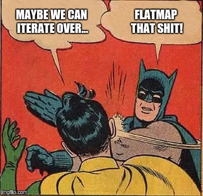

# Category Theory


A [category] is a purely algebraic structure consisting of "objects" and "arrows" between them, much like a directed graph with nodes and edges between them. A category will have objects like `X`, `Y`, `Z`,etc. and arrows between objects. Importantly, arrows **compose**. Given an arrow _f_ from `X` to `Y`, and another arrow _g_ from `Y` to `Z`, their composition is an arrow from `X` to `Z`. There is also an identity arrow from every object to itself.

### Monoid
**In [category theory], a [monoid](http://en.wikipedia.org/wiki/Monoid_(category_theory)) is a [category] with one object.**

The Monoid is essentially the first purely *algebraic* data structure. This kind of algebraic data structures are the corner stone of the technique that gives us a ability to write **polymorphic functions**. A Monoid is made of:

* A type `T` 
* A binary operation, which is associative, that takes two values of type `T` and combines them into one
* A value `zero: T` which is an *identity* for the associative operation

``` scala
trait Monoid[T] {
  // associativity
  // op(op(x, y), z) == op(x, op(y, z))
  def op(x: T, y: T): T

  // identity
  // op(x, zero) == op(zero, x) == x
  def zero: T
}

// example
val stringMonoid = new Monoid[String] {
  override def op(x: String, y: String): String = x + y
  override def zero: String = ""
}
```

### Functor
A Functor is just a type constructor for which `map` can be implemented:

``` scala
trait Functor[F[_]] {
    def map[T, R](fa: F[T])(f: T => R): F[R]
}
```

### Monad
Monads are like _wrappers_ that provide us with two fundamental operations:

* **identity** (that we refer as _unit_ in Scala - or _pure_)
* **bind** (**flatMap** in Scala)

!!! tip "Monads in Category Theory"

    In Category Theory, a Monad is a [Functor](#functor) equipped with a pair of _"natural transformations"_ satisfying the laws of associativity and identity.

And then a question arises spontaneously: how should I describe a Monad in Scala?

``` scala
trait M[T] {
  def flatMap[T](f: T => M[R]): M[R]
}
  
def unit[T](x: T): M[T]
```

As you might have supposed `unit[MyType](x)` performs the wrapping into a `Monad[MyType]` . It's pretty clear that we defined the method `unit()` outside the trait body because we don’t want to invoke it upon the existing monadic object.

!!! important "Monad laws"

    If we have some basic value `x` , a monad instance `m` (holding some value) and functions `f` and `g` of type 
    `Int → M[Int]` , we can write the laws as follows:

    - **left-identity law**: `unit(x).flatMap(f) == f(x)`
    - **right-identity law**: `m.flatMap(unit) == m`
    - **associativity law**: `m.flatMap(f).flatMap(g) == m.flatMap(x ⇒ f(x).flatMap(g))`

!!! note "On flatMap"
    
    ``` 
            map with T => M[R]                  flatten
    M[T]  ------------------------->  M[M[R]]  -----------> M[R]
    ```

!!! question "**Why do we need monads?**"

    4. Functions should (to be simpler) return only **one thing**. 
        - **Solution:** let's create a new type of data to be returned, a "**boxing type**" that encloses maybe a real or be simply nothing. Hence, we can have `g: (x: Real, y: Real) => Option[Real]` . OK, but…
    5. What happens now to `f(g(x,y))` ? `f` is not ready to consume an `Option[Real]` . And, we don't want to change every function we could connect with `g` to consume an `Option[Real]` .
        - **Solution:** let's **have a special function to "connect"/"compose"/"link" functions**. That way, we can, behind the scenes, adapt the output of one function to feed the following one. 
        - In our case: `g.flatMap(f)` (connect/compose `g` to `f` ). We want `flatMap` to get `g` 's output, inspect it and, in case it is `None` just don't call `f` and return `None` ; or on the contrary, extract the boxed `Real` and feed `f` with it.
    6. Many other problems arise which can be solved using this same pattern: 1. Use a "box" to codify/store different meanings/values, and have functions like `g` that return those "boxed values".
    7. Have composers/linkers `g flatMap f` to help connecting `g` 's output to `f` 's input, so we don't have to change `f` at all.
    7. Remarkable problems that can be solved using this technique are: 
        - having a global state that every function in the sequence of functions ("the program") can share: solution `StateMonad` .
        - We don't like "impure functions": functions that yield *different* output for *same* input. Therefore, let's mark those functions, making them to return a tagged/boxed value: `IO` monad.

    https://stackoverflow.com/a/28135478/1977778

## Links

- [Demystifying the monad in Scala](https://medium.com/free-code-camp/demystifying-the-monad-in-scala-cc716bb6f534)

[category theory]: http://en.wikipedia.org/wiki/Category_theory
[category]: http://en.wikipedia.org/wiki/Category_(mathematics)

