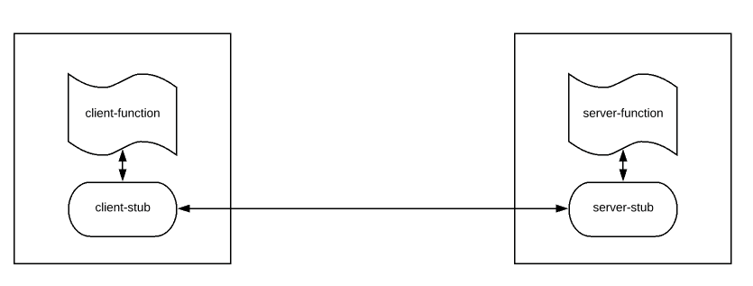

### A step back: HTTP/REST

REST is simple and very easy to use. REST is great for browser. Easy to test our APIs. Developers love this. So we always use REST style to expose our microservices to third-party actors. However it has following issues.

* HTTP/1.1 is textual & Heavy. Microservices exchange information by using huge JSON payload.
* HTTP is stateless. So additional information is sent via headers which are not compressed.
* HTTP/1.1 is unary – that is – you send a request and get a response. You can not send another request until you receive the response.
* HTTP request requires a 3 way message exchange to set up a TCP connection first which is time consuming.

This all can affect the overall performances of our Microservices. REST is good between browser and back-end. But we need something better than REST for inter microservices communication to avoid above mentioned issues.

### RPC

RPC, Remote Procedure Call, is an old mechanism in distributed computing, to execute certain procedure in a remote machine without having to understand the network details. Processes in the same system/different systems which are not sharing the same address space can use RPC for their communication. The call will be made as we would normally invoke a local method call. It follows the client-server model. A client sends a request to the server by invoking a method on the remote server and exchanges messages. RPC provides a well defined interface and type safety.



### What is gRPC?

gRPC is a modern, high-performance framework that evolves the age-old _remote procedure call_ (RPC) protocol. At the application level, gRPC streamlines messaging between clients and back-end services. Originating from Google, gRPC is open source and part of the _Cloud Native Computing Foundation_ (CNCF) ecosystem of cloud-native offerings. CNCF considers gRPC an incubating project. Incubating means end users are using the technology in production applications, and the project has a healthy number of contributors.

A typical gRPC client app will expose a local, in-process function that implements a business operation. Under the covers, that local function invokes another function on a remote machine. What appears to be a local call essentially becomes a transparent out-of-process call to a remote service. The RPC plumbing abstracts the point-to-point networking communication, serialization, and execution between computers.

In cloud-native applications, developers often work across programming languages, frameworks, and technologies. This interoperability complicates message contracts and the plumbing required for cross-platform communication. gRPC provides a "uniform horizontal layer" that abstracts these concerns. Developers code in their native platform focused on business functionality, while gRPC handles communication plumbing.


### Please, go faster!

It is **battle tested for more than a decade**. Google site shows they have been processing **10 BILLIONS requests / second** using gRPC.

gRPC is faster than REST (Checkout this [gRPC vs REST Performance Comparison](https://www.vinsguru.com/grpc-vs-rest-performance-comparison/)). We achieve this performance gain by switching to gRPC because of these 2 important reasons along with other in-built tools.

* **HTTP/2**
* Protocol Buffers (Check this out – [Protobuf / Protocol Buffers – A Simple Introduction](https://www.vinsguru.com/protobuf-a-simple-introduction/))

gRPC by default uses HTTP/2 for transport and Protocol Buffers for message exchange instead of JSON whereas most of the current microservices architectural style is REST with JSON on top of HTTP/1.1

### When to use gRPC

Favor gRPC for the following scenarios:

* **Synchronous backend microservice-to-microservice communication where an immediate response is required** to continue processing.
* Polyglot environments that need to support mixed programming platforms.
* **Low latency and high throughput communication where performance is critical**.
* Point-to-point real-time communication - gRPC can push messages in real time without polling and has excellent support for bi-directional streaming.
* Network constrained environments – **binary gRPC messages are always smaller than an equivalent text-based JSON message**.


### Protocol buffers

gRPC embraces an open-source technology called **Protocol Buffers**. They provide a highly efficient and platform-neutral serialization format for serializing structured messages that services send to each other. Using a cross-platform **Interface Definition Language** (IDL), developers define a service contract for each microservice. The contract, implemented as a text-based `.proto` file, describes the methods, inputs, and outputs for each service. The same contract file can be used for gRPC clients and services built on different development platforms.

Using the proto file, the Protobuf compiler, `protoc`, generates both client and service code for your target platform. The code includes the following components:

* **Strongly typed** objects, shared by the client and service, that represent the service operations and data elements for a message.
* A strongly typed base class with the required network plumbing that the remote gRPC service can inherit and extend.
* A client stub that contains the required plumbing to invoke the remote gRPC service.

At run time, **each message is serialized as a standard Protobuf representation and exchanged between the client and remote service**. Unlike JSON or XML, Protobuf messages are **serialized as compiled binary bytes**.

#### Optional fields

For `string`, `bytes`, and `message` fields, `optional` is compatible with `repeated`. Given serialized data of a repeated field as input, clients that expect this field to be optional will take the last input value if it's a primitive type field or merge all input elements if it's a message type field. Note that this is **not** generally safe for numeric types, including bools and enums. Repeated fields of numeric types can be serialized in the packed format, which will not be parsed correctly when an optional field is expected.

Since protobuf [release 3.15][1], proto3 supports using the `optional` keyword (just as in proto2) to give a scalar field presence information.

```protobuf
    syntax = "proto3";

    message Foo {
        int32 bar = 1;
        optional int32 baz = 2;
    }
```

A `has_baz()`/`hasBaz()` method is generated for the `optional` field above, just as it was in proto2.

Under the hood, protoc effectively treats an `optional` field as if it were declared using a `oneof` wrapper, as [CyberSnoopy’s answer][2] suggested:

```protobuf
    message Foo {
        int32 bar = 1;
        oneof optional_baz {
            int32 baz = 2;
        }
    }
```

If you’ve already used that approach, you can now simplify your message declarations (switch from `oneof` to `optional`) and code, since the wire format is the same.

The nitty-gritty details about field presence and `optional` in proto3 can be found in the [Application note: Field presence][3] doc.

Historical note: Experimental support for `optional` in proto3 was first announced on Apr 23, 2020 in [this comment][4]. Using it required passing protoc the `--experimental_allow_proto3_optional` flag in releases 3.12-3.14.

  [1]: https://github.com/protocolbuffers/protobuf/releases/tag/v3.15.0
  [2]: https://stackoverflow.com/a/46821842/140743
  [3]: https://github.com/protocolbuffers/protobuf/blob/v3.12.0/docs/field_presence.md
  [4]: https://github.com/protocolbuffers/protobuf/issues/1606#issuecomment-618687169

#### Required fields

> We dropped required fields in proto3 because required fields are generally considered harmful and violating protobuf's compatibility semantics. **The whole idea of using protobuf is that it allows you to add/remove fields from your protocol definition while still being fully forward/backward compatible with newer/older binaries**. Required fields break this though. You can never safely add a required field to a .proto definition, nor can you safely remove an existing required field because both of these actions break wire compatibility. For example, if you add a required field to a .proto definition, binaries built with the new definition won't be able to parse data serialized using the old definition because the required field is not present in old data. In a complex system where .proto definitions are shared widely across many different components of the system, adding/removing required fields could easily bring down multiple parts of the system. We have seen production issues caused by this multiple times and it's pretty much banned everywhere inside Google for anyone to add/remove required fields. For this reason we completely removed required fields in proto3.

Proto3 overall seems to favor simplicity, and required removal is simpler. But maybe more convincing, removing required made sense for proto3 when combined with other features, like removal of field presence for primitives and removal of overriding default values.

https://stackoverflow.com/a/31814967/1977778

## Types and errors

* If you want to raise errors, the minimal bound you need is `ApplicativeError`
* if you wanna `flatMap` around, you need to at least use `MonadError`
* If you need to suspend actions you need to raise this to `Sync`
* if you need to work with callback-based APIs, you'll need `Async`

1. https://typelevel.org/cats-effect/docs/typeclasses
2. http://typelevel.org/cats/typeclasses/applicativemonaderror.html

If we stick to `Async`to handle errors properly we have to do something like:

```scala
    if (request.uid.isBlank || request.uid.isEmpty) {
      Async[F].raiseError(
        Status.INVALID_ARGUMENT
          .augmentDescription("You have to provide a valid `uid`. It cannot be blank or empty")
          .asRuntimeException()
      )
    } else ...
```

* https://avi.im/grpc-errors/#scala
* https://github.com/avinassh/grpc-errors/blob/master/scala/src/main/scala/hello/client/HelloClient.scala

### Handle Date and Time using Protobuf
* [Date and time type for use with Protobuf](https://stackoverflow.com/a/42922721/1977778)

## Scala Play and gRPC

Alternative to `fs2-grpc` for Scala Play is based on **Akka gRPC**:

1. https://doc.akka.io/docs/akka-grpc/current/client/walkthrough.html
2. https://developer.lightbend.com/docs/play-grpc/0.5.0/consuming-grpc.html

### Play gRPC sample project

* :point_right: https://github.com/playframework/play-samples/tree/2.8.x/play-scala-grpc-example
   * https://developer.lightbend.com/guides/play-scala-grpc-example/code-details.html
* https://github.com/akka/akka-grpc (https://doc.akka.io/docs/akka-grpc/current/client/walkthrough.html)
* https://developer.lightbend.com/docs/play-grpc/current/ (https://github.com/playframework/play-grpc)
* https://github.com/alexromanov/client-grpc-sample

https://developer.lightbend.com/docs/play-grpc/0.5.0/index.html


## Links

* https://grpc.io/docs/what-is-grpc/introduction/
* [API documentation for the `google.protobuf` package](https://protobuf.dev/reference/protobuf/google.protobuf/)
* [Java reference for Protobuf](https://protobuf.dev/reference/java/)
* https://developers.google.com/protocol-buffers/docs/proto3#json
* https://developers.google.com/protocol-buffers/docs/style
* https://grpc.io/docs/what-is-grpc/core-concepts/
* https://medium.com/expedia-group-tech/introducing-grpc-to-our-hotels-com-platform-part-1-61716af50b13
* https://medium.com/expedia-group-tech/introducing-grpc-to-our-hotels-com-platform-part-2-8024a1dda0aa
* https://docs.microsoft.com/en-us/dotnet/architecture/cloud-native/grpc
* https://www.vinsguru.com/grpc-introduction-guide/
* [ScalaPB](https://medium.com/teads-engineering/bring-grpc-payloads-and-domain-models-closer-with-scalapb-transformations-b23a7115d427)
* [ScalaPB docs](https://scalapb.github.io/docs/grpc)
* [Status codes](https://grpc.github.io/grpc/core/md_doc_statuscodes.html)
* [Error handling](https://www.baeldung.com/grpcs-error-handling)

### Tools

* https://github.com/ktr0731/evans
* GUI => https://github.com/bloomrpc/bloomrpc
