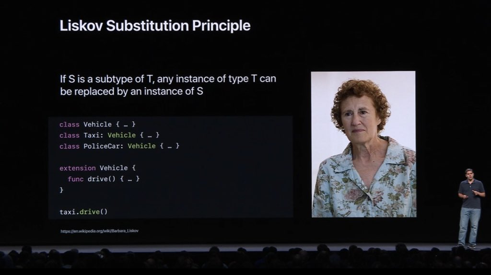
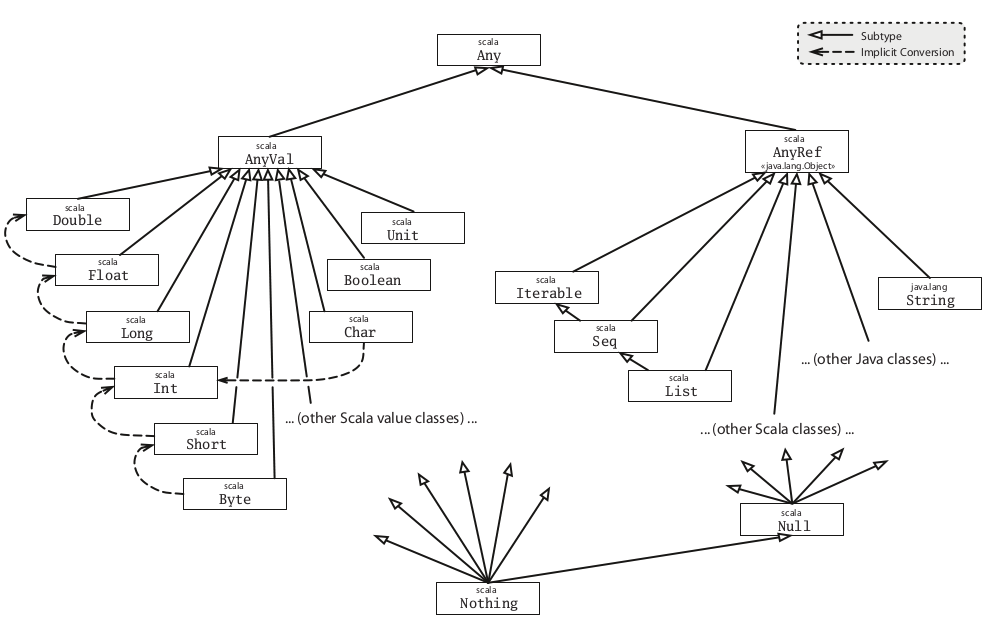

# Scala

## Evaluation rules

* `def` defines a method
* `val` defines a fixed value, it is immmutable and eagerly initialized
* `var` defines a variable reference, it is mutable and it should be avoided
* `lazy` only initialised when required and as late as possible (deferred evaluation), default is strict and is not recomputed like by-name parameters

```scala
def myFunction = 2         // evaluated when called
val myImmutableValue = 2   // evaluated immediately
lazy val iMLazy = 2        // evaluated once when needed

def sort(x: List[Double])       // call by value
def sort(x: => List[Double])    // call by name
// ds is a sequence of Double, containing a varying number of arguments
def varargsFunction(ds: Double*) = ???
```

* **Call by-value**: evaluates the function arguments before calling the function
* **Call by-name**: evaluates the function first, and then evaluates the arguments if need be (each time the parameter is referenced inside the function)

## Type Parameters

Conceptually similar to C++ templates or Java generics. These can apply to classes, traits or functions.

```scala
class TypedClass[F](arg1: F) { ??? }  
new TypedClass[Int](1)  
new TypedClass(1)   // the type is being inferred, i.e. determined based on the value arguments  
```
Conventionally, the type parameters are expressed using uppercase letters (e.g. *A, B, T, F*). It's also possible to restrict the type being used, e.g.

```scala
def func[T <: TopLevel](arg: T): T = { ... } // T must derive from TopLevel or be TopLevel
def func[T >: Level1](arg: T): T = { ... }   // T must be a supertype of Level1
def func[T >: Level1 <: Top Level](arg: T): T = { ... }
```

### Variance

!!! quote

    Variance being a tricky business, **users usually get it wrong**, and they come away thinking that wildcard and generics
    are overly complicated. With definition-side variance, you express your intent to the compiler, and the compiler will
    double check that the methods you want available will indeed be available.

    \- [Programming in Scala][progscala]

**Upper Bounds:**
`[S <: T]` means: S is a subtype of T. Let's suppose that T is actually an `Iterable`, then S could one of `Seq`, `List` or `Iterable`.

**Lower Bounds:**
`[S >: T]` means: S is a supertype of T, or T is a subtype of S. So, if T is a `List`, S could be one of `List`, `Seq`, `Iterable`, or `AnyRef`.

**Mixed Bounds:**
`[S >: T2 <: T1]` means: s is any type on interval between T1 and T2. In this case we have basically a mix of the two cases above.

Let's consider `NonEmpty <: IntSet`, then can we infer that `List[NonEmpty] <: List[IntSet]`?
Intuitively, this makes sense: a list of non-empty sets is a special case of a list of arbitrary sets.
We call types for which this relationship holds **covariant** because their subtyping relationship varies with the type parameter. Thus `Lists` in scala are **covariant**.

Does covariance make sense for all types, not just for List? No. For instance, in Scala, **arrays are not covariant**.

!!! question "When does it make sense to subtype one type with another?"

    > It is safe to assume that a type `T` is a subtype of a type `U` (`T <: U`) if you can substitute a
    value of type `T` wherever a value of type U is required. This is called the _Liskov Substitution Principle_.

    [Liskov Substitution Principle][liskov]

    
    <br>
    https://twitter.com/javi/status/1004821965868109824

Say `C[T]` is a parameterized type, and A, B are types such that:

* Given `A <: B` (A is a subtype of B)
* If `C[A] <: C[B]`, `C` is **covariant**
* If `C[A] >: C[B]`, `C` is **contravariant**
* Neither `C[A]` or `C[B]` is a subtype of the other, then C is **invariant** (or *"nonvariant"*). 

Scala lets you declare the variance of a type by annotating the type parameter:

```scala
class C[+A] { ... } // C is covariant
class C[-A] { ... } // C is contravariant
class C[A]  { ... } // C is invariant
```

So, given that `Any` > `AnyRef` > `IntSet` > `Empty` and `NonEmpty`, if 
```scala
type A = IntSet => NonEmpty
type B = NonEmpty => IntSet
```
According to the [Liskov Principle][liskov] => `A <: B`, since B can return an Empty or NonEmpty, but A can return only NonEmpty.

For a function, if `A2 <: A1` and `B1 <: B2`, then `A1 => B1 <: A2 => B2`. The consequence is that functions must be **contravariant in their argument types and covariant in their result types**.

```scala
/** The Scala Function1 S => T */
trait Function1[-S, +T] {
    // S is contravariant, while T is covariant
    def apply(x: S): T
}
```

This example shows that functions are _contravariant_ in argument types and _covariant_ in return types.

```scala
package io.github.sentenza.cars

class Car {}
class SportsCar extends Car {}
class Ferrari extends SportsCar {}

object morecovariance extends App {

    // Test 1: Works as expected

    def test1( arg: SportsCar => SportsCar ) = {
        new SportsCar
    }

    def foo1(arg: Car): Ferrari = { new Ferrari }
    def foo2(arg: SportsCar): Car = { new Ferrari }
    def foo3(arg: Ferrari): Ferrari = { new Ferrari }

    test1(foo1) // compiles
    test1(foo2) // Fails due to wrong return type. 
    test1(foo3) // Fails due to wrong parameter type

}
```

Find out more about variance in [Covariance And Contravariance in Scala](http://blog.kamkor.me/Covariance-And-Contravariance-In-Scala/)

**Type constructor and Variance**


!!!abstract
    To be added

pag. 392 of the White Scala Manual

## Objects and Code organization

!!! quote
    *Scala has no globally visible methods: every method must be contained in an object or a class. However, using methods named `apply` inside global objects, you can support usage patterns that look like invocations of global methods.*
    
    From [*Programming in Scala - Second edition (by M. Odersky, L. Spoon, B. Venners)*][progscala]

As you can read above, I introduced **Objects in terms of the functions they contain**. It's very important to stress on this aspect, because Classes and Objects should be seen under a different light using Scala, especially if you come from an imperative OOP language, like Java or C++. They are just a way to organise your functions and at some point, using traits, objects (companion objects) and case classes (data constructors) you will eventually be able to build up your coding architecture based on types and composition of functions.

- [About _Case Class_](https://stackoverflow.com/a/53990873/1977778)

### General object hierarchy



!!! note 
    All members of packages `scala` and `java.lang` as well as all members of the object `scala.Predef` are automatically imported.

* `scala.Nothing` is a trait that is the bottom subtype of every subtype of `scala.Any`
    * `scala.Any` base type of all types. It has methods `hashCode` and `toString` that can be overridden
* `scala.AnyVal` is the base type of all primitive types: `Double`, `Float`, etc.
* `scala.AnyRef` base type of all reference types. (alias of `java.lang.Object`, supertype of `java.lang.String`, `scala.List`, any user-defined class)
* `scala.Null` is a subtype of any `scala.AnyRef`, and `scala.Nothing` is a subtype of any other type without any instance.
    * `Null` is a trait and is the bottom type similiar to `Nothing` but only for `AnyRef` not `AnyVal`
    * `null` is the only instance of type `Null`
* `Nil` is an empty list that is defined as a `List[Nothing]`
* `None` is an empty option that is defined as a `Option[Nothing]`
* `Unit` is a subtype of `AnyVal`, it's only value is `()` and it is not represented by any object in the underlying runtime system. A method with return type `Unit` is analogous to a Java method which is declared `void`


### Factory Object

The following example has been taken from [Programming in Scala][progscala]:

```scala
abstract class Element {
    def contents: Array[String]
    def height: Int = contents.length
    def width: Int = if (height == 0) 0 else contents(0).length
}

class ArrayElements(val contents: Array[String]) extends Element 

// Invoking superclass constructor while extending the class itself
class LineElement(s: String) extends ArrayElement(Array(s)) {
    override def width = s.length // Int is inferred
    override def width = 1
}

class UniformElement(
    ch: Char,
    override val width: Int,
    override val heigth: Int
) extends Element {
    private val line = ch.toString * width
    def contents = Array.fill(height)(line)
}
```

Now, what we can do is defining a *Factory Object* which contains methods that construct other objects, without exposing each class implementation. Basically, we can hide each class inside a Singleton Object, which will represent just a tag for the overloaded methods that will give us the ability to instantiate each subclass dinamically, and using polymorphism at the same time.

!!! important
    Note that **OOP is not a paradigm, but it's just a way to define our code structure in a logic manner** that is similar to playing with LEGOs. OOP can be seen like an **orthogonal dimension** compared to functional, declarative or imperative paradigms.

```scala
// We start defining a Singleton Object
object Element {
    // we can now hide classes as private fields of this object
    private class ArrayElements(
        val contents: Array[String]
    ) extends Element

    private class LineElement(s: String) extends Element {
        val contents = Array(s)
        override def width = s.length
        override def width = 1
    }

    private class UniformElement(
        ch: Char,
        override val width: Int,
        override val heigth: Int
    ) extends Element {
        private val line = ch.toString * width
        def contents = Array.fill(height)(line)
    } 

    // FACTORY
    def elem(contents: Array[String]): Element =
        new ArrayElement(contents)

    def elem(chr: Char, width: Int, heigth: Int): Element = 
        new UniformElement(chr, width, height)

    def elem(line: String): Elem =
        new LineElement(line)
}
```

Objects creation are centralized and the details now are hidden. 

!!! tip "Open/Closed Principle"
    This will eventually give an easy way to understand how to use these elements, and at the same time this small change will give the developer the **Open/Closed Principle** for free because less detail is exposed.
    
    > *“Software entities … should be open for extension, but closed for modification.”*

    This provides more opportunities to **change the implementation of the library without breaking client code**. At the same time a class will have a single responsibility, and only one potential change in the software’s specification should be able to affect the specification of the class (**Single Responsibility Principle**). So, writing `SOLID` code pays off at the end. 

### Factory method

In Java you can create a private constructor by making it `private`. In Scala one can achieve the same behaviour prepending the `private` modifier to the default constructor. 

```scala
class Point private(coordX: Float, coordY: Float) {
    val x = coordX
    val y = coordY

    /** Public auxiliary constructor
      * Setting the point at the origin of the Cartesian axes
      * calling the default private constructor using the 
      */ 
    def this() = this(0.0, 0.0)

    def getPoint = (x, y)
}
```

You cannot instantiate a new point using the default constructor:

```scala
val errorPoint = new Point(45.9, 21.08) // ERROR
val correctPoint = new Point() // (0.0, 0.0)
```

A possible solution to define a new `Point` is given by the usage of a *companion object* and a **factory method** that will give us a convenient way to define a new object, without actually call the `new` operator. To do so one can add the `apply()` method to the newly created object, which will have the same acess rights to the `Point` class if placed in the same file.

Therefore, the `apply()` method will be able to use the private construction of the `Point` class and then it will become a **factory method**:

```scala
class Point[T <: Double] private(coordX: T, coordY: T) { ... }
object Point {
    def apply[T <: Double](x: T, y: T) = new Point[T](x, y)
}
```


## Collections

Scala defines several collection classes:

#### Base Classes

- [`Iterable`](http://www.scala-lang.org/api/current/index.html#scala.collection.Iterable) (collections you can iterate on)
- [`Seq`](http://www.scala-lang.org/api/current/index.html#scala.collection.Seq) (ordered sequences)
- [`Set`](http://www.scala-lang.org/api/current/index.html#scala.collection.Set)
- [`Map`](http://www.scala-lang.org/api/current/index.html#scala.collection.Map) (lookup data structure)

#### Immutable Collections

- [`List`](http://www.scala-lang.org/api/current/index.html#scala.collection.immutable.List) (linked list, provides fast sequential access)
- [`Stream`](http://www.scala-lang.org/api/current/index.html#scala.collection.immutable.Stream) (same as List, except that the tail is evaluated only on demand)
- [`Vector`](http://www.scala-lang.org/api/current/index.html#scala.collection.immutable.Vector) (array-like type, implemented as tree of blocks, provides fast random access)
- [`Range`](http://www.scala-lang.org/api/current/index.html#scala.collection.immutable.Range) (ordered sequence of integers with equal spacing)
- [`String`](http://docs.oracle.com/javase/1.5.0/docs/api/java/lang/String.html) (Java type, implicitly converted to a character sequence, so you can treat every string like a `Seq[Char]`)
- [`Map`](http://www.scala-lang.org/api/current/index.html#scala.collection.immutable.Map) (collection that maps keys to values)
- [`Set`](http://www.scala-lang.org/api/current/index.html#scala.collection.immutable.Set) (collection without duplicate elements)

#### Mutable Collections

- [`Array`](http://www.scala-lang.org/api/current/index.html#scala.Array) (Scala arrays are native JVM arrays at runtime, therefore they are very performant)
- Scala also has mutable maps and sets; **these should only be used if there are performance issues with immutable types**

#### Collections snippet

!!! snippet

    ```scala
    val r: Range = 1 until 5 // 1, 2, 3, 4
    val s: Range = 1 to 5    // 1, 2, 3, 4, 5
    1 to 10 by 3  // 1, 4, 7, 10
    6 to 1 by -2  // 6, 4, 2

    // Operations on sequences
    val xs = List(...)
    xs.length   // number of elements, complexity O(n)
    xs.last     // last element (exception if xs is empty), complexity O(n)
    xs.init     // all elements of xs but the last (exception if xs is empty), complexity O(n)
    xs take n   // first n elements of xs
    xs drop n   // the rest of the collection after taking n elements
    xs(n)       // the nth element of xs, complexity O(n)
    xs ++ ys    // concatenation, complexity O(n)
    xs.reverse  // reverse the order, complexity O(n)
    xs updated(n, x)  // same list than xs, except at index n where it contains x, complexity O(n)
    xs indexOf x      // the index of the first element equal to x (-1 otherwise)
    xs contains x     // same as xs indexOf x >= 0
    xs filter p       // returns a list of the elements that satisfy the predicate p
    xs filterNot p    // filter with negated p 
    xs partition p    // same as (xs filter p, xs filterNot p)
    xs takeWhile p    // the longest prefix consisting of elements that satisfy p
    xs dropWhile p    // the remainder of the list after any leading element satisfying p have been removed
    xs span p         // same as (xs takeWhile p, xs dropWhile p)

    List(x1, ..., xn) reduceLeft op    // (...(x1 op x2) op x3) op ...) op xn
    List(x1, ..., xn).foldLeft(z)(op)  // (...( z op x1) op x2) op ...) op xn
    List(x1, ..., xn) reduceRight op   // x1 op (... (x{n-1} op xn) ...)
    List(x1, ..., xn).foldRight(z)(op) // x1 op (... (    xn op  z) ...)

    xs exists p    // true if there is at least one element for which predicate p is true
    xs forall p    // true if p(x) is true for all elements
    xs zip ys      // returns a list of pairs which groups elements with same index together
    xs unzip       // opposite of zip: returns a pair of two lists
    xs.flatMap f   // applies the function to all elements and concatenates the result
    xs.sum         // sum of elements of the numeric collection
    xs.product     // product of elements of the numeric collection
    xs.max         // maximum of collection
    xs.min         // minimum of collection
    xs.flatten     // flattens a collection of collection into a single-level collection
    xs groupBy f   // returns a map which points to a list of elements
    xs distinct    // sequence of distinct entries (removes duplicates)

    x +: xs  // creates a new collection with leading element x
    xs :+ x  // creates a new collection with trailing element x

    // Operations on maps
    val myMap = Map("I" -> 1, "V" -> 5, "X" -> 10)  // create a map
    myMap("I")      // => 1  
    myMap("A")      // => java.util.NoSuchElementException  
    myMap get "A"   // => None 
    myMap get "I"   // => Some(1)
    myMap.updated("V", 15)  // returns a new map where "V" maps to 15 (entry is updated)
                            // if the key ("V" here) does not exist, a new entry is added

    // Operations on Streams
    val xs = Stream(1, 2, 3)
    val xs = Stream.cons(1, Stream.cons(2, Stream.cons(3, Stream.empty))) // same as above
    (1 to 1000).toStream // => Stream(1, ?)
    x #:: xs // Same as Stream.cons(x, xs)
                // In the Stream's cons operator, the second parameter (the tail)
                // is defined as a "call by name" parameter.
                // Note that x::xs always produces a List
    ```


#### Pairs (similar for larger Tuples)

```scala
    val pair = ("answer", 42)   // type: (String, Int)
    val x = ("x" -> 90)         // type: (String, Int)
    val y = ("y" -> -5)         // type: (String, Int)
    val z = ("z" -> 0)          // type: (String, Int)
    val (label, value) = pair   // label = "answer", value = 42  
    pair._1 // "answer"  
    pair._2 // 42  
```

#### Ordering

There is already a class in the standard library that represents orderings: `scala.math.Ordering[T]` which contains
comparison functions such as `lt()` and `gt()` for standard types. Types with a single natural ordering should inherit from 
the trait `scala.math.Ordered[T]`.
```scala
import math.Ordering  

def msort[T](xs: List[T])(implicit ord: Ordering) = { ...}  
msort(fruits)(Ordering.String)  
msort(fruits)   // the compiler figures out the right ordering  
```

### Typeclass

!!!quote
    *[...] Type class is a class (group) of types, which satisfy some contract defined in a trait with addition that such functionality (trait and implementation) can be added without any changes to the original code. One could say that the same could be achieved by extending a simple trait, but with type classes it is not necessary to predict such a need beforehand.*
    
    *There is no special syntax in Scala to express a type class, but the same functionality can be achieved using constructs that already exist in the language. **That’s what makes it a little difficult for newcomers to spot a type class in code. A typical implementation of a type class uses some syntactic sugar as well, which also doesn’t make it clear right away what we are dealing with**.*

    https://blog.scalac.io/2017/04/19/typeclasses-in-scala.html


# SBT

- [Defining dependencies and Settins in /project](https://kubuszok.com/2018/relearn-your-sbt/#project)


[liskov]: https://stackoverflow.com/a/584732/1977778
[progscala]: https://www.artima.com/shop/programming_in_scala
